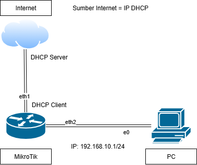

# Fitur-Quick-Set-pada-MikroTik
Quick Set merupakan sebuah fitur pada MikroTik yang menyajikan interface konfigurasi awal MikroTik yang disederhanakan dan lebih cepat, memungkinkan pengguna untuk mengatur router dengan beberapa klik saja. Berikut beberapa contoh penggunaan fitur Quick Set:

# 1. Sumber Internet DHCP
 Berikut topologinya:

 • Log in ke Mikrotik menggunakan Winbox (pastikan MikroTik dalam keadaan kosong/tanpa konfigurasi) \
 • Klik tab Quick Set pada bagian paling kiri atas\
 • Isi dengan contoh format sebagai berikut\
  Mode                    : Router\
  Address Acquistion      : Automatic\
  Local Network IP Address: 192.168.10.1\
                   Netmask: 255.255.255.0(/24) \
  Ceklis NAT

 

 • Klik OK\
 • Cek pada tab DHCP Client, IP Address, dan Firewall untuk menyesuaikan dengan yang sudah di setting
