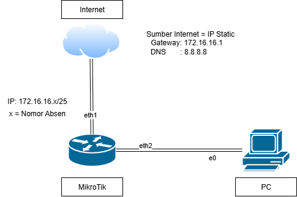

# Fitur-Quick-Set-pada-MikroTik
Quick Set merupakan fitur pada MikroTik yang menyajikan interface konfigurasi awal MikroTik yang disederhanakan dan lebih cepat, memungkinkan pengguna untuk mengatur router dengan beberapa klik saja. Berikut beberapa contoh penggunaan fitur Quick Set:

# 1. Sumber Internet DHCP
 Berikut topologinya:

 • Log in ke Mikrotik menggunakan Winbox (pastikan MikroTik dalam keadaan kosong/tanpa konfigurasi) \
 • Klik tab Quick Set pada bagian paling kiri atas\
 • Isi dengan contoh format sebagai berikut\
  Mode                    : Router\
  Address Acquistion      : Automatic\
  Local Network IP Address: 192.168.10.1\
                   Netmask: 255.255.255.0(/24) \
  Ceklis NAT

 

 • Klik OK\
 • Cek pada tab DHCP Client, IP Address, dan Firewall untuk menyesuaikan dengan yang sudah di setting

# 1. Sumber Internet Static
 Berikut topologinya:

 • Log in ke Mikrotik menggunakan Winbox (pastikan MikroTik dalam keadaan kosong/tanpa konfigurasi) \
 • Klik tab Quick Set pada bagian paling kiri atas\
 • Isi dengan contoh format sebagai berikut\
  Mode                    : Router\
  Address Acquistion      : Static
  Internet IP Address     : 192.168.70.49 (Jika tidak tahu IP default ISP bisa cek repo sebelumnya yang berjudul "Mengoneksikan MikroTik ke Internet") \
  Gateway                 : 172.16.16.1
  DNS Server              : 8.8.8.8
  Local Network IP Address: 172.16.16.30\
                   Netmask: 255.255.255.128(/25) \
  Ceklis NAT

 

 • Klik OK\
 • Cek pada tab DHCP Client, IP Address, dan Firewall untuk menyesuaikan dengan yang sudah di setting

Keuntungan dari fitur Quick Set ini adalah:\
 ⦁ Waktu yang digunakan untuk konfigurasi sangatlah singkat.\
 ⦁ konfigurasi awal menjadi lebih praktis
 
 Kesimpulan :\
 ⦁	Futur Quick Set ini berguna untuk mempersingkat waktu konfigurasi awal dengan membuatnya lebih praktis dan mudah dipahami.\

Sekian yang dapat saya sampaikan, mohon maaf apabila ada salah kata atau kekurangan dalam penyampaian. Akhir kata, Wassalam
